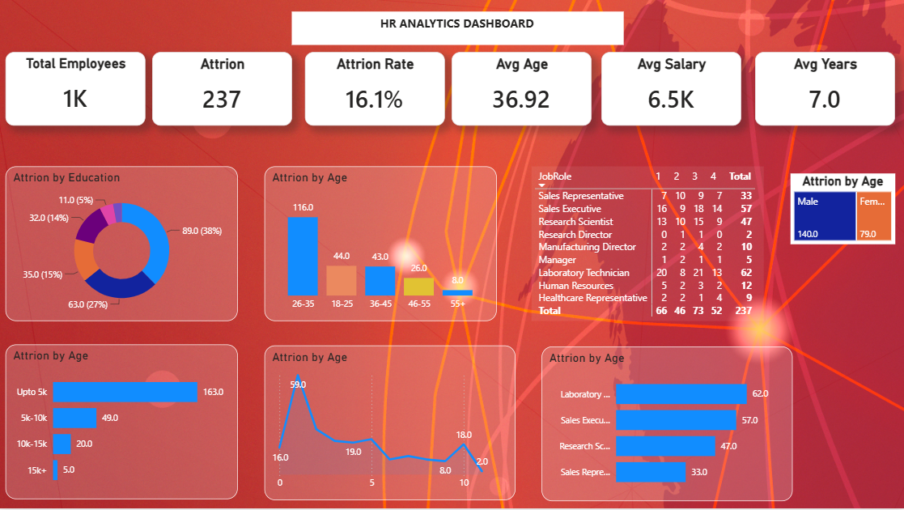

# 📊 HR Analytics Dashboard



## 📌 Project Overview

The **HR Analytics Dashboard** is an interactive Power BI project designed to analyze employee attrition patterns and workforce demographics. The dashboard helps HR teams understand why employees leave the organization by analyzing factors such as age, education, salary, job role, and years at the company.

The objective of this project is to transform raw HR data into meaningful business insights that support data-driven workforce planning and employee retention strategies.

---

# 🎯 Business Problem

Employee attrition is one of the biggest challenges for organizations. High employee turnover increases recruitment costs, reduces productivity, and affects overall business performance.

The HR department wants answers to questions such as:

- Which employees are leaving the company?
- Which age group has the highest attrition?
- Which job roles are most affected?
- Does salary influence employee attrition?
- Which education background experiences the highest turnover?

---

# 🎯 Dashboard Goal

The dashboard helps HR managers:

- Monitor employee attrition trends
- Identify high-risk employee groups
- Analyze workforce demographics
- Improve employee retention strategies
- Support HR decision-making using data

---

# 🛠 Tech Stack

The dashboard was developed using the following tools and technologies:

- 📊 **Power BI Desktop** – Dashboard development and visualization
- 📂 **Power Query** – Data cleaning and transformation
- 🧠 **DAX (Data Analysis Expressions)** – KPI calculations and measures
- 🔗 **Data Modeling** – Relationship management between tables
- 📈 **Charts & Visualizations** – Interactive reports and KPI cards
- 📁 **CSV Dataset** – HR employee data

---

# 📂 Data Source

**Source:** HR Employee Attrition Dataset

The dataset contains employee-level information including:

- Employee ID
- Age
- Gender
- Education
- Department
- Job Role
- Monthly Income
- Years at Company
- Attrition Status
- Salary Slab

The dataset was cleaned and transformed using **Power Query** before building the dashboard.

---

# 📊 Dashboard Features

## KPI Cards

The dashboard highlights key workforce metrics:

- 👥 Total Employees
- 🚪 Attrition Count
- 📉 Attrition Rate
- 🎂 Average Age
- 💰 Average Salary
- 📅 Average Years at Company

---

## Dashboard Walkthrough

### 📌 Attrition by Education

Analyzes employee attrition across different education backgrounds to identify which qualification groups experience higher turnover.

---

### 📌 Attrition by Age Group

Shows attrition distribution among different age categories, helping HR identify the most vulnerable workforce segment.

---

### 📌 Attrition by Salary Slab

Compares attrition across salary ranges to understand how compensation influences employee retention.

---

### 📌 Attrition by Job Role

Highlights job roles with the highest employee turnover, enabling management to prioritize retention efforts.

---

### 📌 Job Role Matrix

Displays employee attrition across different job roles for detailed workforce analysis.

---

### 📌 Gender-wise Attrition

Compares attrition between male and female employees.

---

# 📈 Key Insights

- Employees aged **26–35 years** have the highest attrition.
- Lower salary groups experience significantly higher employee turnover.
- Laboratory Technicians and Sales Executives contribute the highest attrition counts.
- Employees with Bachelor's degrees represent the largest share of attrition.
- Overall employee attrition rate is **16.1%**.

---

# 💡 Business Impact

The dashboard enables HR teams to:

- Improve employee retention strategies
- Identify departments requiring immediate attention
- Monitor workforce trends
- Support hiring and compensation decisions
- Reduce employee turnover through data-driven insights

---

# 📷 Dashboard Preview


---

# 🚀 Skills Demonstrated

- Power BI Dashboard Development
- Power Query Data Cleaning
- Data Modeling
- DAX Measures
- KPI Design
- HR Data Analysis
- Business Intelligence
- Data Visualization
- Dashboard Storytelling

---

# 📁 Repository Structure

```
HR-Analytics-Dashboard/
│
├── Dashboard.pbix
├── HR_Analytics.csv
├── hrbvf.png
├── README.md
```

---

# 👨‍💻 Author

**Vikas Pradhan**

- 📧 Data Analyst Aspirant
- 💼 Power BI | SQL | Excel | Python
- 🌐 GitHub: https://github.com/vikas605
